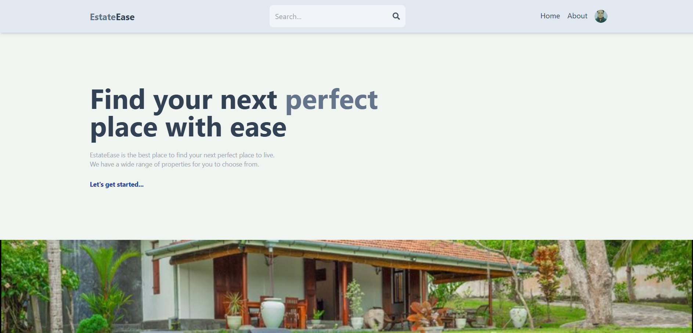
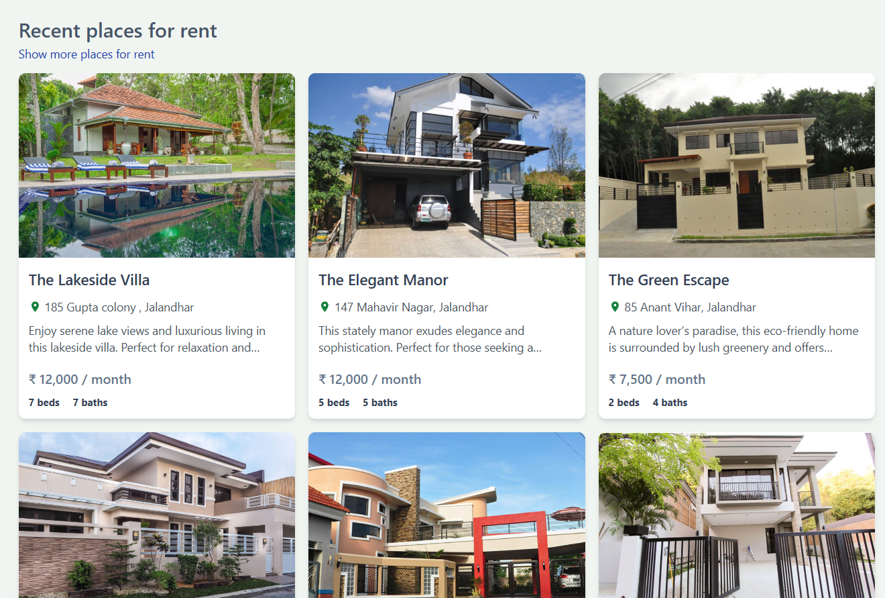
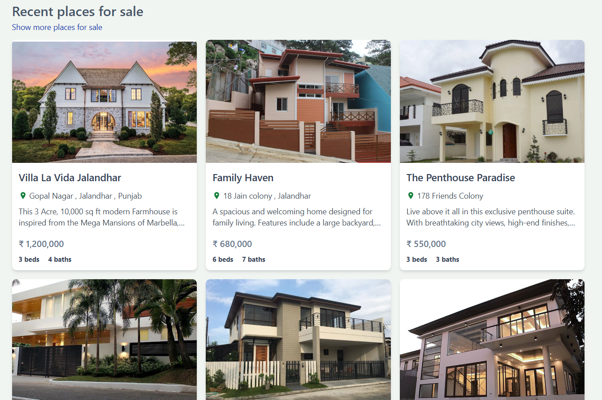
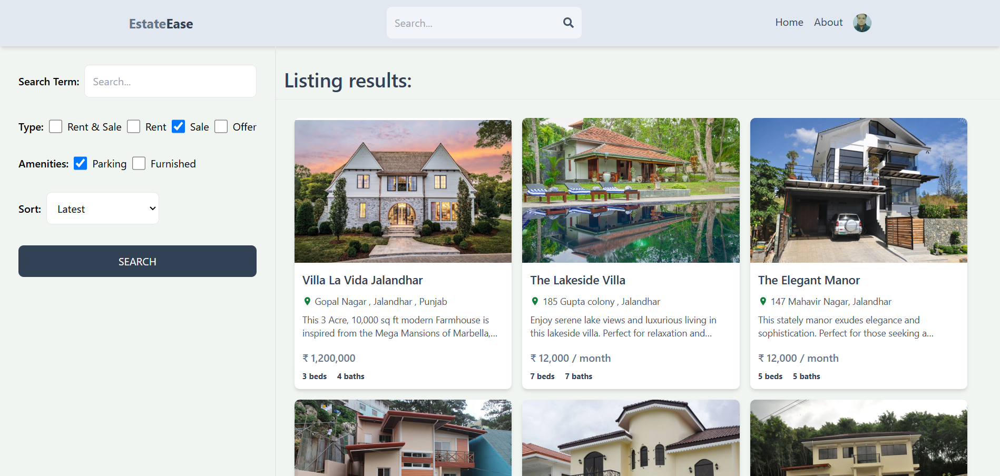
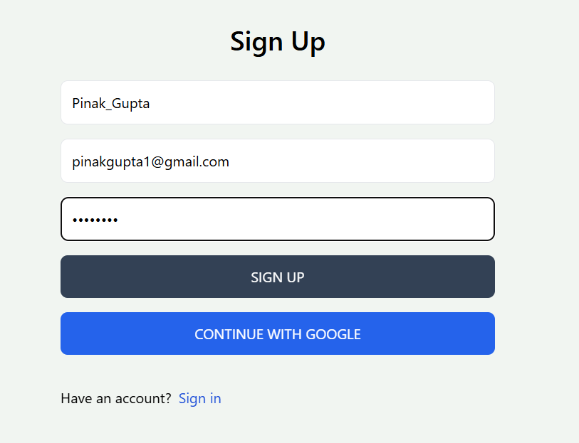
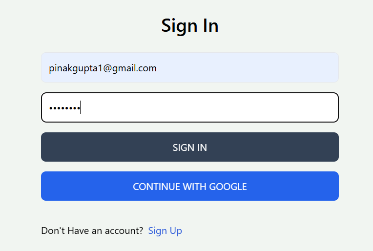
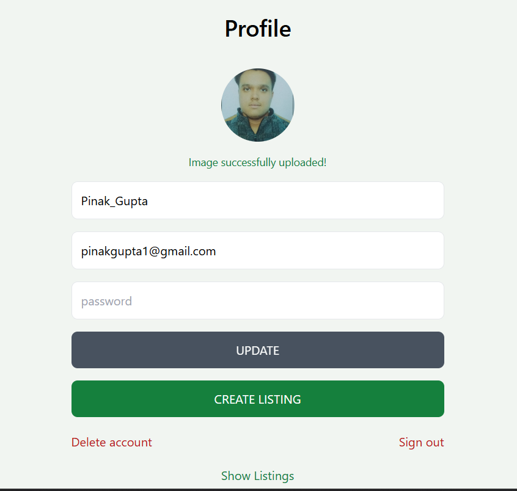
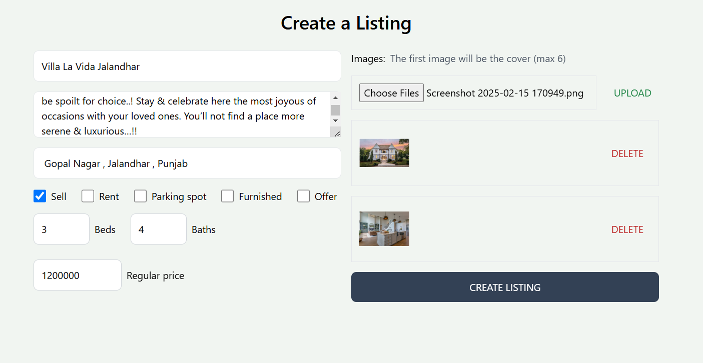

# 🏡 **EstateEase**  
**Simplify Your Real Estate Journey**  

EstateEase is a 🌟 **feature-rich real estate platform** 🌟 built using the powerful **MERN stack**. Whether you're buying, selling, renting, or leasing, EstateEase has got you covered! Perfect for both households 🏠 and commercial properties 🏢, it’s designed to provide an intuitive, seamless, and efficient experience.  

---

## 🚀 **Features**  

- 🔑 **Property Listings**: Easily list your property for sale or rent.  
- 🔍 **Search and Filters**: Find your dream property based on **bedrooms 🛏️**, **bathrooms 🛁**, **location 📍**, and more.  
- 📧 **Direct Communication**: Contact landlords directly via email from the platform.  
- 📱 **Responsive Design**: Fully optimized for both mobile and desktop users for a smooth browsing experience.  

---

## 🖼️ **Screenshots**  

### 🏠 Home Page
Here are three screenshots showcasing the homepage of EstateEase:

**Homepage - Screenshot 1**:


**Homepage - Screenshot 2**:


**Homepage - Screenshot 3**:


### 🔍 Search Feature
Easily filter and search for properties:


### 📝 Signup Page
Simple and intuitive signup process:


### 🔑 Signin Page
Secure and easy signin page:


### 👤 Profile Page
Manage your account details on the profile page:


### 🏘️ Create Listing
Effortlessly add new properties for sale or rent:


### 📋 Property Listing
View detailed property information in listings:


---

## 🛠️ **Technologies Used**  

- **MongoDB**: 🗂️ Database  
- **Express.js**: 🚀 Backend framework  
- **React.js**: 🎨 Frontend framework  
- **Node.js**: 🌐 Server environment  

---

## ⚙️ **Installation**  

To run this project locally, follow these steps:  

1. Clone the repository:
    ```bash
    git clone https://github.com/yourusername/EstateEase.git
    ```

2. Navigate to the project directory:
    ```bash
    cd EstateEase
    ```

3. Install dependencies for both backend and frontend:
    ```bash
    npm install
    cd client
    npm install
    cd ..
    ```

4. Create a `.env` file in the root directory and add your environment variables:
    ```env
    MONGO_URI=your_mongodb_connection_string
    EMAIL_SERVICE=your_email_service
    EMAIL_USER=your_email_user
    EMAIL_PASS=your_email_password
    ```

5. Run the development server:
    ```bash
    npm run dev
    ```

---

## 📖 **Usage**  

1. **🔎 Browse Listings**: Use filters to narrow down search results.
2. **📧 Contact Landlords**: Click on a listing to view details and send an email directly from the platform.
3. **🏘️ Add Listings**: If you're a seller or landlord, list your property for sale or rent.

---

## 🤝 **Contributing**  

Contributions are welcome! 💡 Please fork this repository and submit a pull request for any features, improvements, or bug fixes. Let's build something amazing together! 🚀

---

## 📜 **License**  

This project is licensed under the MIT License. See the [LICENSE](LICENSE) file for details.  

---

## 👤 **Author**  

👨‍💻 **Pinak Gupta**  

---

## 🌟 **Acknowledgements**  

- 💡 Inspiration for this project came from the need to simplify real estate transactions.
- 🙌 Thanks to the MERN stack community for their extensive documentation and support.

---

Enjoy using EstateEase! 🚀 Your one-stop solution for real estate. 🏠
